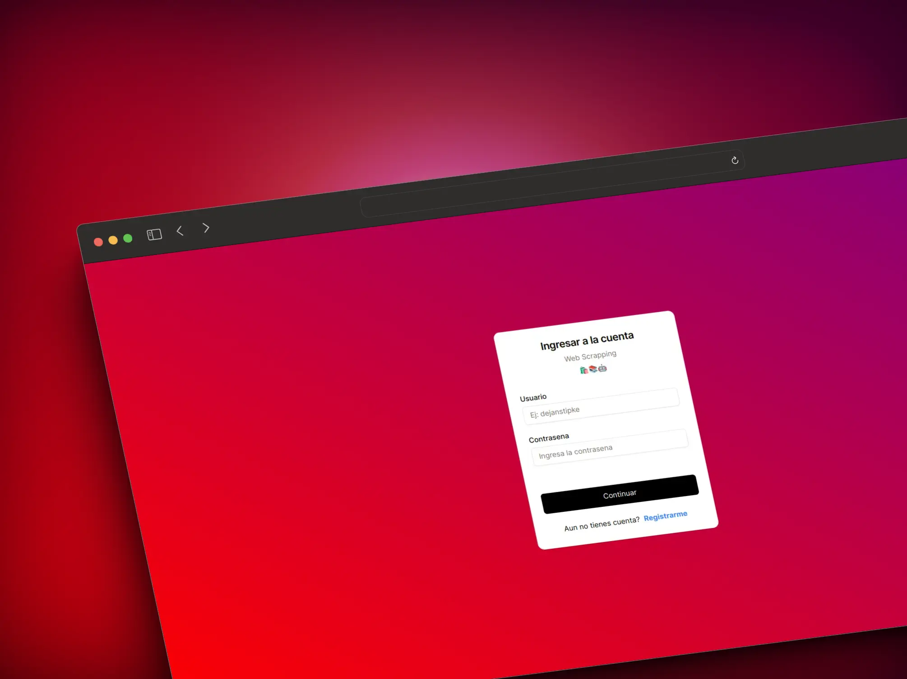
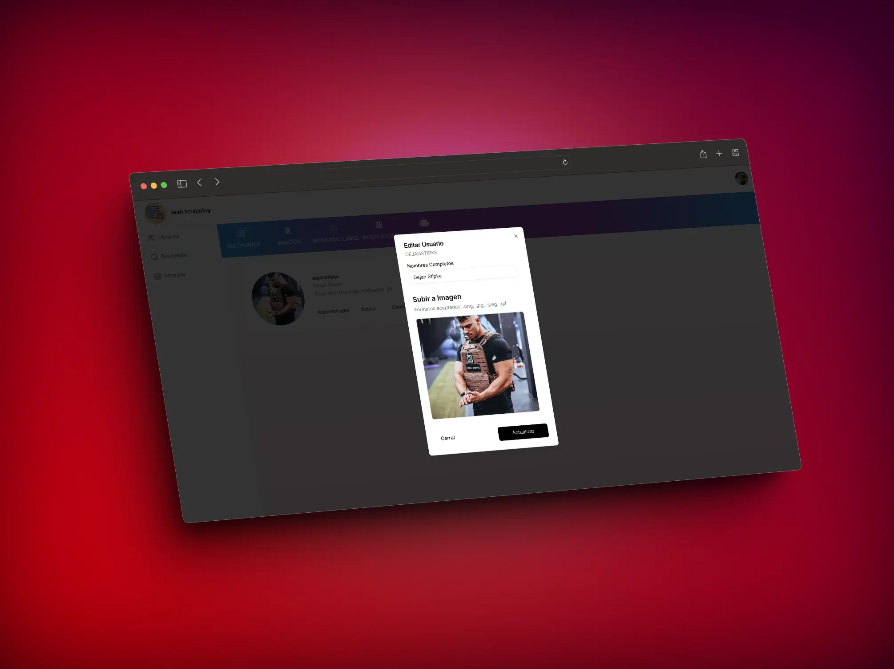
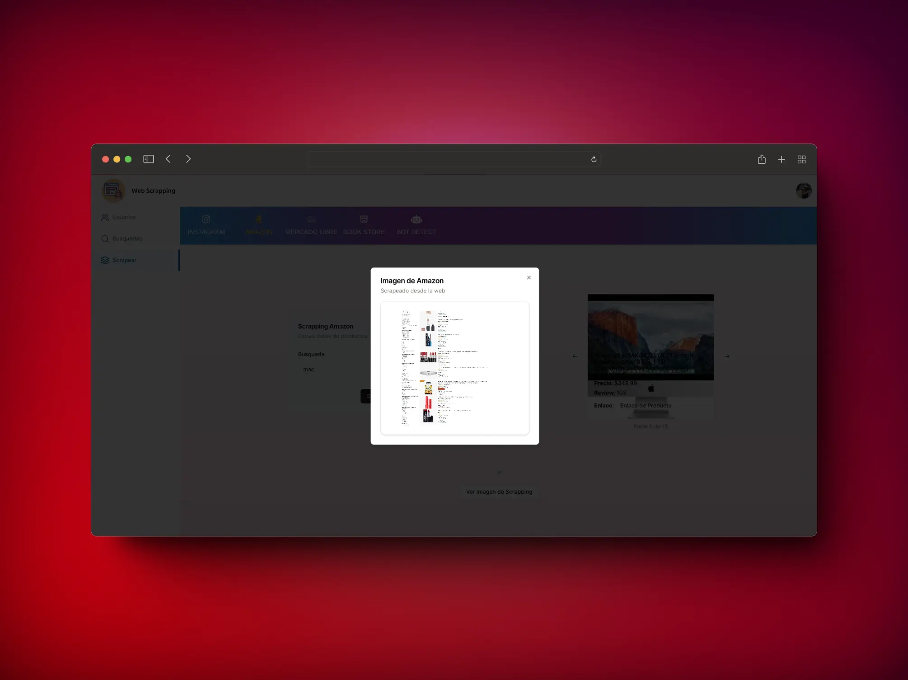
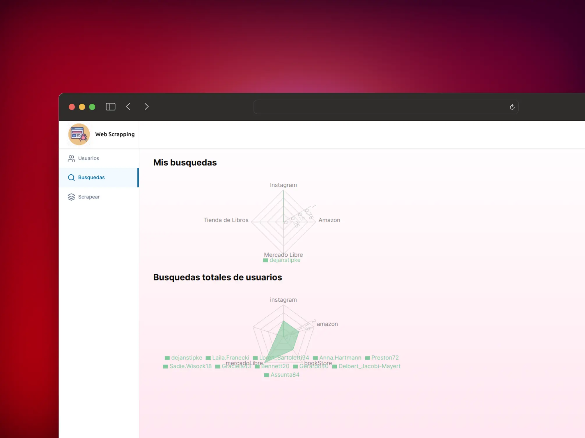
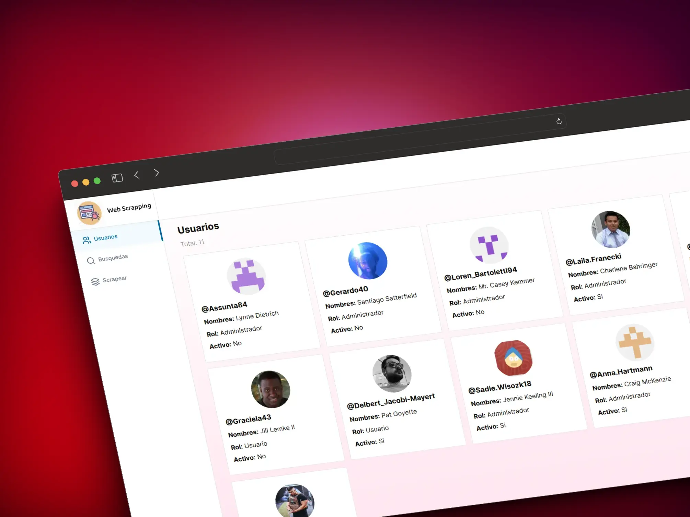

<h1 align="center">
    Puppeteer NextJS
    
    </a>
    </a>
</h1>

<p align="center">
  <i align="center">App to scrapping from websites 🚀</i>
</p>



<details open>
<summary>
 Preview
</summary> <br />

<p align="center">
    
&nbsp;
    
</p>

<p align="center">
    
&nbsp;
 
</p> 
</details>

## Table Of Content

- [Table Of Content](#table-of-content)
- [Introduction](#introduction)
  - [Instalation Manual](#instalation-manual)
- [Production](#production)
  - [Database Setup](#database-setup)
  - [Security](#security)

## Introduction

Puppeteer Nextjs is a open-source development project designed to scrapping purposes and allows effortless customization of the code and offers a diverse range of scrapping and meticulously tailored adhering to industry best practices.

### Instalation Manual

First, It's vital to know some pre-requisites to run this project and in development.

<details close>
<summary>
Pre-requisites
</summary> <br />
To be able to start development on this app, make sure that you have the following prerequisites installed:

<br/>

- Node.js
- PostgresQL
- Git
</details>

<details close>
<summary>
Stack
</summary> 
Some tech stacks that have been used for this project
<br/>
<br/>

- [Recharts](https://recharts.org/en-US/api/RadarChart) - Charts.
- [Shadcn UI](https://ui.shadcn.com/docs) - **UI** Docs.
- [Lucia Auth](https://lucia-auth.com/) - **Authentication**.
- [Zustand](https://docs.pmnd.rs/zustand/guides/updating-state) - **State** Management.
- [NEXTJS](https://nextjs.org/docs/app/building-your-application/routing/parallel-routes) - **Framework** (Parallel Routes).

</details>

To setup a local development environment the following steps can be followed:

<br/>

1.  Add environment variables in the root project like **.env**. Some of these are showed in **./lib/constants.ts**

2.  Then, put all migrations to the database with this command:
    <br/>

```bash
# Init database with all migrations pre-existing
npx prisma migrate reset

```

3. Run server development

```bash
npm install
npm run dev
```

4. See the database with the studio

```bash
npx prisma studio
```

<details close>
<summary>
Some useful commands
</summary>

```bash
# DB
# Reset DB
npx prisma migrate reset

# Make migrations to db
npx prisma migrate --name firstMigration

# Generate types to @prisma/client
npx prisma generate

# Push changes to the db without migrations
npx prisma db seed

# Seed db
npx prisma db seed

# Generate secret key (unix)
openssl rand -base64 32

# Delete cache env
git rm --cached -r .env*
```

</details>

## Production

This project has been deployed with [Vercel Docs](https://vercel.com/docs). I recommend to follow the [Deploy Docs](https://vercel.com/docs/getting-started-with-vercel/import) step by step to deploy NextJS

Visit this project in production [scrapping-nextjs :rocket:](https://puppeteer-nextjs-blond.vercel.app/)

### Database Setup

To stablish joins between tables it was neccesary to add some config in schema.prisma and if it's demanded to create custom ids through postgresql. Add previewFeatures something like that:

```prisma
 generator client {
  provider        = "prisma-client-js"
  // to unix
  binaryTargets   = ["native", "debian-openssl-1.1.x", "debian-openssl-3.0.x", "linux-musl", "linux-musl-openssl-3.0.x"]
  // joins tables
  previewFeatures = ["postgresqlExtensions", "relationJoins"]
}

datasource db {
  ...
  // joins tables
  relationMode = "prisma"
  // to generate ids with potsgresql (dbgenerated)
  extensions   = [pgcrypto]
}

model User {
  id String @id @default(dbgenerated("gen_random_uuid()")) @db.Uuid
  ...
}
```

### Security

Lucia manage a way to handling sessions through cookies. By this way it's neccesary to add an extra layout of security such as argon2 but with a secret key to effort. Despite of this, session has a duration define by 1 week. Then, there's no session available on the confirmation page, it will be redirect to recreate a new session with the login page:

```typescript
export const lucia = new Lucia(adapter, {
    ...
    sessionExpiresIn: new TimeSpan(1, "w")
});
```

```typescript
export const SECRET_HASH_PASS = Buffer.from(SECRET_HASH, "utf8") as Buffer;

// code in route handler
export async function hashedPassword(password: string) {
  const hash = await argon2.hash(password, optionsArgon2);
  return hash;
}

// code in server actions
const hashedPassword = await new Argon2id({ secret: SECRET_HASH_PASS }).hash(
  password
);
```
